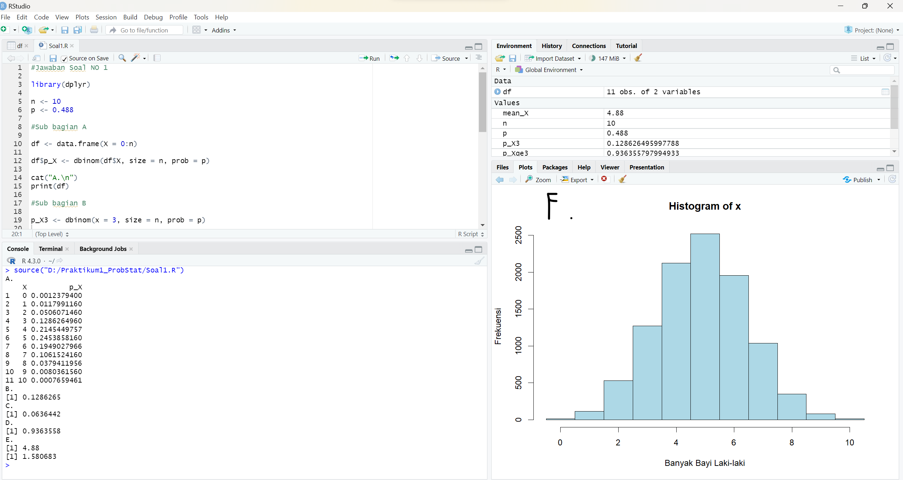
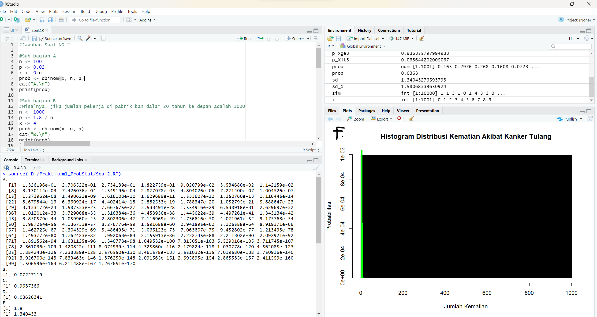
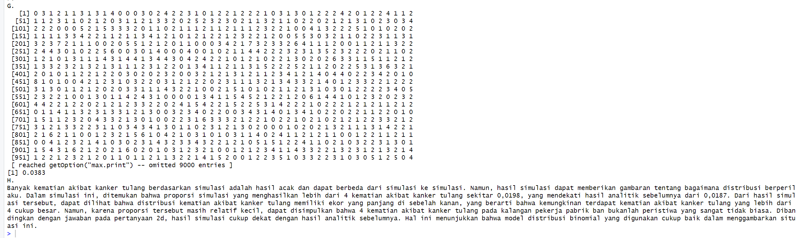
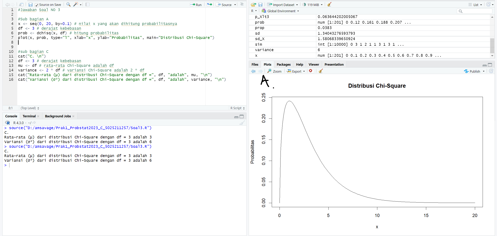
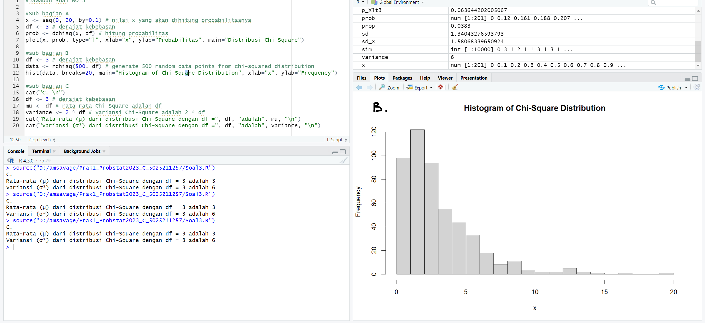
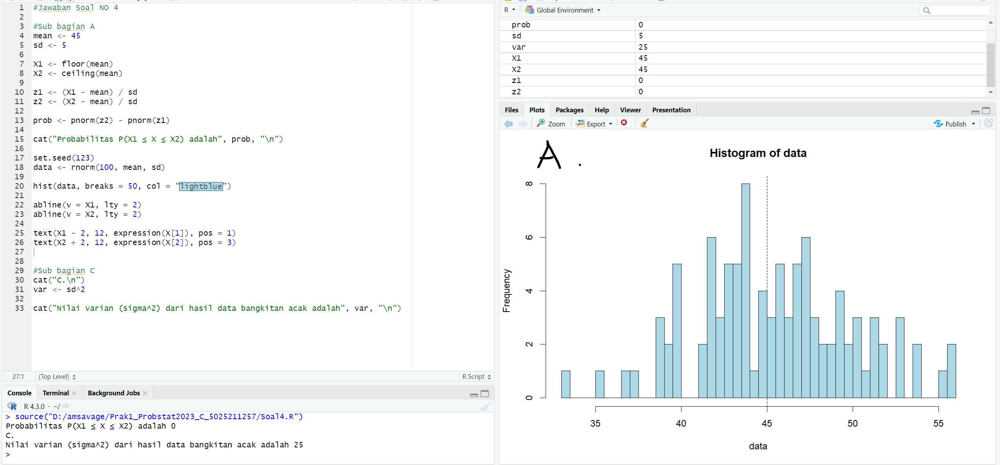
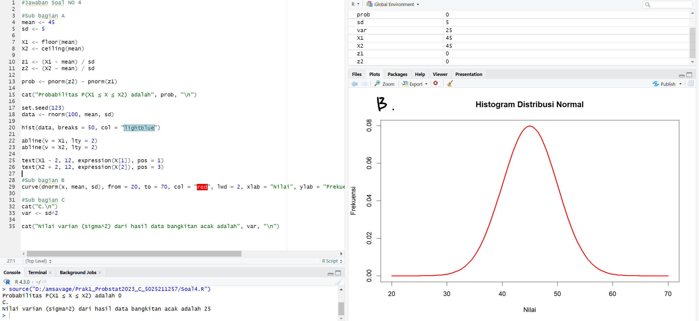

# Prak1_Probstat2023_C_5025211257
- Immanuel Pascanov Samosir ~ Teknik Informatika 2021

## Screenshot dan penjelasan singkat pengerjaan praktikum. 

### Soal 1

Berikut merupakan screenshoot output Soal1.R 

Penjelasan singkat untuk setiap poin soal :

a. Pendistribusian banyak bayi laki-laki
   Menentukan pendistribusian banyak bayi laki-laki dalam 10 kelahiran. Karena setiap kelahiran dapat menghasilkan bayi laki-laki atau perempuan dengan probabilitas yang sama, maka digunakan distribusi binomial sebagai distribusi yang sesuai. Parameter distribusi binomial yang digunakan adalah n=10 (jumlah percobaan) dan p=0.488 (probabilitas sukses).

b. Probabilitas tepat tiga bayi di antaranya berjenis kelamin laki-laki
   Menghitung probabilitas tepat tiga bayi di antaranya berjenis kelamin laki-laki. Karena sudah mengetahui distribusi banyak bayi laki-laki dalam 10 kelahiran dari poin (a), maka digunakan fungsi probabilitas massa (PMF) binomial untuk menghitung probabilitas ini.

c. Probabilitas kurang dari tiga bayi di antaranya berjenis kelamin laki-laki
   Menghitung probabilitas kurang dari tiga bayi di antaranya berjenis kelamin laki-laki. Maka digunakan fungsi distribusi kumulatif (CDF) binomial untuk menghitung probabilitas ini.

d. Probabilitas tiga atau lebih bayi di antaranya berjenis kelamin laki-laki
   Menghitung probabilitas tiga atau lebih bayi di antaranya berjenis kelamin laki-laki. Karena sudah mengetahui probabilitas kurang dari tiga bayi laki-laki dari poin (c), maka dapat menghitung probabilitas tiga atau lebih bayi laki-laki dengan mengurangkan probabilitas kurang dari tiga bayi laki-laki dari 1.

e. Nilai harapan dan simpangan baku banyak bayi laki-laki
   Menghitung nilai harapan (mean) dan simpangan baku (standard deviation) banyak bayi laki-laki dalam 10 kelahiran. Karena sudah mengetahui distribusi banyak bayi laki-laki dalam 10 kelahiran dari poin (a), maka nilai harapan dan simpangan baku dihitung dengan menggunakan rumus yang sesuai.

f. Histogram pendistribusian banyak bayi laki-laki
   Histogram yang menggambarkan distribusi banyak bayi laki-laki dalam 10 kelahiran. Menghasilkan sampel acak dari distribusi binomial dengan menggunakan fungsi acak (random) binomial. Setelah itu, dapat menghitung frekuensi masing-masing nilai banyak bayi laki-laki.

### Soal 2

Berikut merupakan screenshoot output Soal2.R 

Lanjutan G-H

Penjelasan singkat untuk setiap poin soal :

a. Menghitung probabilitas distribusi binomial 
   untuk nilai x dari 0 hingga n (di mana n = 100 dan p = 0,02).

b. Menghitung probabilitas distribusi binomial 
   untuk jumlah kematian akibat kanker tulang sebanyak 4 pada 1000 pekerja di pabrik ban dalam 20 tahun ke depan.

c. Menghitung probabilitas kumulatif distribusi binomial 
   untuk jumlah kematian akibat kanker tulang sebanyak 4 pada 1000 pekerja di pabrik ban dalam 20 tahun   ke depan.

d. Menghitung probabilitas komplementer distribusi binomial 
   untuk jumlah kematian akibat kanker tulang yang lebih dari 4 pada 1000 pekerja di pabrik ban dalam 20 tahun ke depan.

e. Menghitung nilai rata-rata dan standar deviasi distribusi binomial 
   untuk jumlah kematian akibat kanker tulang pada 1000 pekerja di pabrik ban dalam 20 tahun ke depan.

f. Menggambar histogram distribusi binomial 
   untuk jumlah kematian akibat kanker tulang pada 1000 pekerja di pabrik ban dalam 20 tahun ke depan.

g. Menggunakan simulasi 
   untuk memeriksa hasil analitik sebelumnya dengan menghitung proporsi simulasi yang menghasilkan lebih dari 4 kematian akibat kanker     tulang pada 1000 pekerja di pabrik ban dalam 20 tahun ke depan.

h. Menjelaskan hasil simulasi dan membandingkannya dengan hasil analitik sebelumnya. 

### Soal 3

Berikut merupakan screenshoot output Soal3.R 

Berikut merupakan screenshoot output code poin B

Penjelasan singkat untuk setiap poin soal :

a. Menghitung fungsi probabilitas dari distribusi Chi-Square
   Digunakan fungsi dchisq(), fungsi ini menerima dua argumen: x adalah nilai yang akan dihitung probabilitasnya, dan df adalah derajat kebebasan dari distribusi Chi-Square.

b. Histogram dari distribusi Chi-Square 
   Fungsi ini menerima satu argumen, yaitu vektor data yang akan diplotkan dalam bentuk histogram. 500 data acak dari distribusi Chi-Square dengan derajat kebebasan yang telah ditentukan dihasilkan menggunakan fungsi rchisq(), kemudian ditambahkan opsi breaks pada perintah hist() untuk menentukan jumlah batang histogram.

c. Menghitung nilai rata-rata dan variansi dari distribusi Chi-Square
   Menggunakan rumus matematika yang telah ditentukan sebelumnya. Rata-rata dari distribusi Chi-Square dengan derajat kebebasan df adalah sama dengan df, dan variansinya adalah 2 kali df. Nilai rata-rata dan variansi dicetak ke konsol menggunakan fungsi cat().

### Soal 4

Berikut merupakan screenshoot output Soal4.R 

Berikut merupakan screenshoot output code poin B

Penjelasan singkat untuk setiap poin soal :

a. Fungsi probabilitas dari distribusi Normal P(X1 ≤ x ≤ X2), hitung z-scorenya dan plot data bangkitan acaknya dalam bentuk grafik.

    * Mengatur nilai rata-rata dan standar deviasi.
    * Menghitung X1 dan X2.
    * Menghitung z-score untuk X1 dan X2.
    * Menghitung probabilitas menggunakan fungsi pnorm.
    * Mencetak probabilitas.
    * Membangkitkan data acak menggunakan fungsi rnorm.
    * Menampilkan histogram data acak dengan breaks sebanyak 50.
    * Menambahkan garis vertikal pada X1 dan X2 pada grafik histogram.
    * Menambahkan teks pada grafik histogram untuk menunjukkan nilai X1 dan X2.

b. Histogram dari distribusi Normal dengan breaks 50

    * Menampilkan histogram distribusi Normal dengan menggunakan fungsi curve.
    * Menentukan rentang nilai dari 20 hingga 70 pada sumbu x.
    * Menentukan label sumbu x dan y, serta judul grafik histogram.

c. Nilai varian (σ²) dari hasil data bangkitan acak distribusi Normal

    * Menghitung varian dengan rumus sd^2.
    * Mencetak nilai varian.

### Soal 5

Berikut merupakan screenshoot output Soal5.R 

Penjelasan singkat untuk setiap poin soal :
a. pt(-2.34, df = 6) 
   Menghitung probabilitas terjadinya suatu peristiwa acak X kurang dari -2.34 pada distribusi T-Student dengan 6 derajat kebebasan.

b. 1 - pt(1.34, df = 6)  
   Menghitung probabilitas terjadinya suatu peristiwa acak X lebih dari 1.34 pada distribusi T-Student dengan 6 derajat kebebasan.

c. pt(-1.23, df = 3) + (1 - pt(1.23, df = 3))
   Menghitung probabilitas terjadinya suatu peristiwa acak X kurang dari -1.23 atau lebih besar dari 1.23 pada distribusi T-Student dengan 3 derajat kebebasan.

d. pt(0.94, df = 14) - pt(-0.94, df = 14)
   Menghitung probabilitas terjadinya suatu peristiwa acak X berada di antara -0.94 dan 0.94 pada distribusi T-Student dengan 14 derajat kebebasan.

e. q <- qt(0.0333, df = 5); q  
   Mencari t-score dengan 5 derajat kebebasan yang memiliki luasan 0.0333 satuan persegi di bawah kurva dan di sebelah kiri t-score tersebut pada distribusi T-Student.

f. q <- qt(0.875, df = 25); q
   Mencari t-score dengan 25 derajat kebebasan yang memiliki luasan 0.125 satuan persegi di bawah kurva dan di sebelah kanan t-score tersebut pada distribusi T-Student.

g. q <- qt(0.375, df = 11); -q
   Mencari nilai t-score dengan 11 derajat kebebasan yang memiliki luasan 0.75 satuan persegi di bawah kurva dan di antara t-score tersebut dan negatif dari nilai t-score tersebut pada distribusi T-Student.

h. q <- qt(0.0333, df = 23); lower <- qt((1-0.0333)/2, df = 23, lower.tail = TRUE); upper <- -lower; c(lower, -q, q, upper)  
   Mencari nilai t-score dengan 23 derajat kebebasan yang memiliki luasan 0.0333 satuan persegi di bawah kurva dan di luar interval antara t-score tersebut dan negatif dari nilai t-score tersebut pada distribusi T-Student. Nilai t-score tersebut diberikan dalam bentuk vektor, dengan urutan lower, -q, q, dan upper.

